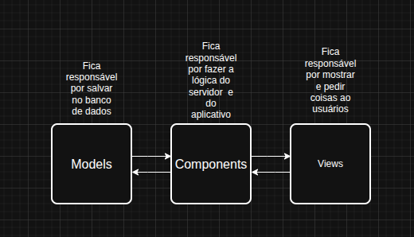

# Laravel Shop

## Intro

É um shop desenvolvido com intuito de aprendizagem(sem pagamento real) Laravel, Eloquent e Livewire, quee permite criar e gerenciar produtos, além de vende-los, ou comprar produtos(sem pagamento real).

## Requisitos de versões minimos

- Composer >= 2.8.12
- Laravel >= 5.25.3
- PHP >= 8.4.1
  
## Arquitecture

É construído com a arqquitetura MVC, com o CONTROLLER sendo substítuido por COMPONENTS



## Bibliotecas

- [Laravel](https://laravel.com/)
- [Livewire](https://livewire.laravel.com/)
- [Bootstrap](https://getbootstrap.com/)
- [PHPUnit](https://phpunit.de/index.html)

## Getting Started

1 - Primeiro clone o repositório:

``` git clone https://github.com/CoffeeCoder-Go/livewire-laravel-shop.git ```

2 - Depois entre na pasta e rode:

``` composer install ```

3 - E para migrar, rode:

``` php artisan migrate ```

4 - Para fazer um link entre o que é público e o que está no servidor, rode:

``` php artisan storage:link ```

5 - Por fim, se quiser ver o app funcionando, rode:

``` php artisan serve ```

6(Opcional, ainda não implementado) - Você pode quer obter certeza de que tudo está funcionando com deveria, ou pelo menos, a lógica, então rode:

``` php artisan test ```
